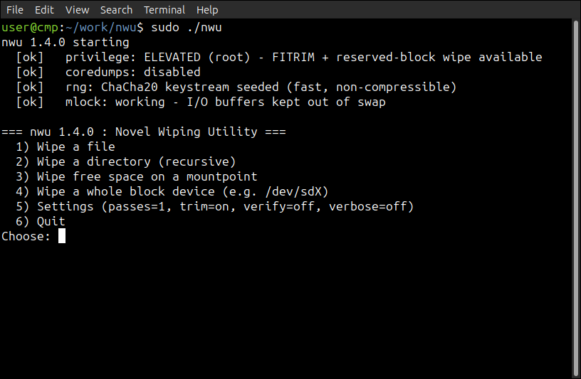

<div align="center">
   
<a href="https://github.com/effjy/nwu/"></a>


</div>

SSD-aware secure delete and free-space wipe, in C++. Runs as an **interactive
menu** or from the **command line** for scripting. The novel point is that it
**combines** logical overwrite with controller-level **discard (TRIM)** in one
operation, instead of relying on either alone. It also scrubs **free RAM** to
clear sensitive data left behind in previously-used memory pages.

## Screenshot



## Why overwriting alone fails on SSDs

SSDs do wear leveling: a "write" lands on a fresh physical NAND page and the old
page is merely unmapped — the stale data physically survives until the
controller garbage-collects it. Over-provisioning also hides 7–28% of the chip
from the OS entirely. So `shred`-style overwrites mostly poison the *currently
mapped* copy and leave older physical copies recoverable with controller-level
tools.

The only command that authorizes the controller to physically reclaim/erase a
block is **TRIM/discard**.

## What nwu does

**File / directory wipe** (`wipe`)
1. Overwrite the bytes with a fast, non-compressible random stream + `fdatasync`
   — poisons the mapped copy and covers drives that ignore/lack TRIM. The
   overwrite is **rounded up to the filesystem block size**, so the slack at the
   tail of the final block is erased too, not just the `st_size` bytes.
2. `fallocate(PUNCH_HOLE)` the file's own extents — per-file discard while the
   fd is still open.
3. Destroy the name: several **random renames**, each followed by an `fsync` of
   the containing directory so the metadata change actually reaches disk, then
   truncate and unlink. Directories are walked depth-first (`nftw`): every file
   is wiped, symlinks/special files are dropped, then the empty dirs removed.
4. `FITRIM` the containing filesystem — tells the controller every free block
   may be erased.

**Free-space wipe** (`free`)
Fill all free space with the random stream → `fdatasync` → release → `FITRIM`
the whole filesystem. The overwrite catches slack space and non-TRIM drives; the
TRIM maximizes how much the controller is told it can physically erase. To wipe
*as much as possible*:
- as **root** it fills `f_bfree` (including the root-reserved blocks, ~5% on
  ext4), not just the unprivileged `f_bavail`;
- it **rolls onto additional fill files** when one hits the filesystem's maximum
  file size (`EFBIG` — e.g. 4 GiB on FAT32/exFAT), so the *entire* free area is
  covered rather than only the first file's worth.

The fill files are anonymous (unlinked immediately), so a crash or power loss
auto-reclaims them instead of leaving a giant file behind. A live **progress
bar** shows percentage, bytes written, throughput, and ETA. When run
interactively (a TTY), press **`s`** to stop early — nwu still syncs, releases,
and TRIMs whatever was already written.

**RAM wipe** (`ram`)
Allocate (almost) all free memory in chunks, **pin each block (`mlock`)** so it
can't be paged out, and overwrite it with the random stream — scrubbing
sensitive data (keys, plaintext, decrypted buffers) that a previous process left
behind in now-freed physical pages. A **safety margin** of free RAM
(`NWU_RAM_SAFETY_MB`, default 256 MB) is always left so the system stays
responsive, and the fill stops automatically when it reaches that margin. The
scrubbed memory stays **pinned and allocated** until you explicitly release it,
at which point every block is zeroed, unpinned and freed:
- in the **CLI**, the fill runs, then pressing **Enter** releases the RAM (during
  the fill, **Ctrl+C** stops allocating but keeps what's already pinned);
- in the **GUI**, the **RAM** tab has a **Start RAM wipe** and a **Release RAM**
  button.

This is best-effort: it can only reach memory the kernel will hand to a
userspace process (not kernel buffers or another process's RAM), and DRAM
cleared this way still loses residual charge over time on its own.

**The random stream.** Bulk overwrite uses a userspace **ChaCha20** keystream
seeded once from `getrandom()` (verified against the RFC 8439 test vector). This
is both fast (GB/s, so large free-space wipes actually finish) and genuinely
high-entropy — SandForce-class SSD controllers transparently compress/dedupe
low-entropy patterns, which would make a naive zero/repeating fill never
physically overwrite anything. Small security-sensitive values (the seed, the
random rename names) come straight from the kernel CSPRNG.

## Prerequisites

Linux only. nwu ships **two front-ends** that share one wiping engine:

- **`nwu`** — the command-line tool. **No third-party dependencies** (only the
  Linux/glibc APIs: `getrandom`, `fallocate`, `FITRIM`, `nftw`, …).
- **`nwu-gui`** — a **GTK4** desktop GUI. Needs the GTK4 development package.

You need a C++ compiler (C++20: g++ ≥ 10 / clang++ ≥ 10), `make`, the standard
libc headers, and (for the GUI only) **GTK 4**.

Debian / Ubuntu:
```sh
sudo apt update
sudo apt install build-essential libgtk-4-dev
```

Fedora / RHEL:
```sh
sudo dnf install gcc-c++ make glibc-devel gtk4-devel
```

Arch:
```sh
sudo pacman -S base-devel gtk4
```

> The CLI builds with no GTK at all — if you only want `nwu`, run `make cli`
> (skips the GUI and its GTK dependency).

## Build & install globally

```sh
git clone https://github.com/effjy/nwu.git
cd nwu
make                       # builds ./nwu and ./nwu-gui
sudo make install          # installs BOTH binaries + icon + desktop entry
```

`sudo make install` puts everything in place globally:

| Installed | Path |
| --------- | ---- |
| CLI       | `/usr/local/bin/nwu` |
| GUI       | `/usr/local/bin/nwu-gui` |
| Icon      | `/usr/local/share/icons/hicolor/scalable/apps/nwu.svg` |
| Launcher  | `/usr/local/share/applications/nwu.desktop` |

The desktop entry + hicolor icon make **nwu-gui** show up in your application
menu and display its own icon in the window title bar / taskbar. (The install
refreshes the icon and desktop databases automatically.)

Verify:
```sh
nwu -V                     # -> nwu 1.5.0
nwu-gui                    # launches the GTK4 window
```

Uninstall / clean:
```sh
sudo make uninstall        # removes both binaries, the icon and the desktop entry
make clean                 # removes the local build
```

Install somewhere else with `PREFIX`:
```sh
make install PREFIX=$HOME/.local      # -> ~/.local/bin/{nwu,nwu-gui}
```

## GUI (`nwu-gui`)

Prefer a desktop window? Launch **nwu-gui** from your application menu (it
installs a `.desktop` entry and icon) or from a terminal:

```sh
nwu-gui          # unprivileged: file/free-space wipes
sudo nwu-gui     # root: FITRIM, reserved-block fills and whole-device wipes
```

The window has a tab for each operation — **File / Folder**, **Free space**,
**Device**, and **RAM** — plus the shared options (passes, TRIM/discard,
read-back verify, verbose) and a **Stop** button to end a running wipe
gracefully. It runs the exact same engine as the CLI: every wipe runs on a worker
thread and the engine's live output (including the progress bar, which updates in
place on a single line) streams into the log pane. Destructive actions pop a
confirmation dialog first, and the whole-disk **Device** tab is clearly marked
and offers the firmware secure-erase options. The **RAM** tab has **Start RAM
wipe** / **Release RAM** buttons. An **About** button shows version and license.

When launched unprivileged, a **Relaunch as root** button re-runs the GUI under
`pkexec` (forwarding the display environment so the elevated window actually
appears, and your home directory so the file chooser still opens in your own
files rather than `/root`).

## Usage (CLI)

Launch the interactive menu (no arguments) — guides you through wiping a file, a
directory, free space, a whole device, or **RAM**, with confirmation prompts:

```sh
nwu
```

Command line (for scripts):

```sh
nwu [-p N] [-T] [-c] [-v] wipe   <path>...    # secure-delete file(s) and/or dir tree(s)
nwu [-p N] [-T] [-v]      free   <mountpoint> # fill & wipe free space, then TRIM
nwu [-p N] [-T] [-c] [-y] device <blockdev>   # wipe a WHOLE device + BLKDISCARD (root)
nwu                       ram                 # scrub free RAM, release on Enter
```

**Options**

| Option | Meaning |
| ------ | ------- |
| `-p N` | Overwrite passes (default `1`; more passes only help on HDDs, not SSDs). |
| `-T`   | Skip the filesystem TRIM / device-discard step. |
| `-c`   | Verify the overwrite by reading it back (slower). |
| `-y`   | Skip the typed confirmation for `device` wipes (**dangerous**; for scripts). |
| `--secure-erase` | After a `device` wipe, issue the drive's **firmware secure erase** — native NVMe Format, or ATA Secure Erase via `hdparm` for SATA. |
| `--crypto-erase` | Like `--secure-erase` but request a **cryptographic** erase (destroys the drive's internal encryption key — near-instant on SEDs). |
| `-v`   | Verbose output. |
| `-V`   | Print version and exit. |
| `-h`   | Show help. |

**Examples**

```sh
# Securely delete a single file
sudo nwu wipe ~/secret.key

# Wipe several files and a whole directory tree at once
sudo nwu wipe ./old-keys/ report.pdf backup.tar

# Wipe the free space on a mounted drive (e.g. a USB stick), then TRIM it
sudo nwu free /media/usb

# Scrub free RAM (overwrite previously-used memory pages), Enter to release
nwu ram

# Overwrite 3 times, verbose, no TRIM
sudo nwu -p 3 -v -T wipe ./sensitive.db

# Overwrite, then read it back to confirm the data actually landed
sudo nwu -c wipe ~/secret.key

# Wipe a whole UNMOUNTED device: overwrite (O_DIRECT) + BLKDISCARD, then it
# prints the firmware secure-erase command for a hard guarantee
sudo nwu device /dev/sdb            # prompts you to type the device path
sudo nwu -y -c device /dev/sdb      # no prompt + verify (for scripts)

# Overwrite + discard, THEN have the drive run its own firmware secure erase
sudo nwu --secure-erase device /dev/nvme0n1   # native NVMe Format (SES=1)
sudo nwu --crypto-erase device /dev/nvme0n1   # cryptographic erase (SES=2)
sudo nwu --secure-erase device /dev/sdb       # SATA: ATA Secure Erase via hdparm
```

> **⚠ `device` erases the entire block device.** It refuses if the device (or any
> of its partitions) is **mounted, in use as swap, or claimed by a stacking layer**
> (LVM / md-raid / LUKS / device-mapper) — matched by *canonical* path, so a
> symlinked source (`/dev/disk/by-id/…`, `/dev/mapper/…`) is caught too. Unless you
> pass `-y` it also makes you type the exact device path to confirm. Double-check
> with `lsblk` first.

`FITRIM` needs **root** and a discard-capable filesystem/stack. If discard is
unavailable (an HDD, a VM disk, or an encrypted volume like LUKS mounted without
`discard`), nwu still performs the full random overwrite — only the optional
TRIM step is skipped, which it reports in verbose mode.

> **On a fully encrypted disk** (LUKS / LVM-on-LUKS), free-space wiping is mostly
> redundant: the stale blocks are already ciphertext. There, the strongest erase
> is destroying the key — `sudo cryptsetup erase /dev/<luks-partition>` — which
> instantly renders the *whole* device unrecoverable.

## Changelog

**1.6.0**
- **Safer `device` guard.** The "is this device in use?" check no longer relies on
  a plain `/proc/mounts` substring match. It now canonicalizes the target with
  `realpath` (so a **symlinked** mount/swap source such as `/dev/disk/by-id/…` or
  `/dev/mapper/…` is recognized), also refuses a device that is an **active swap**
  (`/proc/swaps`, which never shows in `/proc/mounts`) or is **claimed by a
  stacking layer** — LVM PV, md-raid member, LUKS/`device-mapper` backing store —
  directly or through one of its partitions (sysfs `holders/`). Partition matching
  is boundary-aware (`sdb` → `sdb1`, `nvme0n1` → `nvme0n1p1`) instead of a loose
  prefix.
- **Device read-back verify (`-c`) now reads from the device, not the cache.** The
  whole-device verify keeps **`O_DIRECT`** on (re-enabling it if the write loop had
  fallen back to buffered I/O), so the read-back comes straight off the medium —
  `POSIX_FADV_DONTNEED` is unreliable on block devices. It falls back to
  cache-eviction only if the device refuses `O_DIRECT`. This also removes a
  potential spurious `VERIFY FAILED` from unaligned I/O.
- **Graceful stop no longer discards the whole device.** Hitting **`s`** / **Stop**
  during a `device` wipe now skips the `BLKDISCARD` over the rest of the device, so
  the untouched tail is left intact (matching the "only partially overwritten"
  message) instead of being handed to the controller anyway.
- **Read-back verify uses a non-zero pattern.** Verification now writes and reads
  back a fixed non-zero byte (`0xA5`) instead of zeros: a zero read-back can be
  produced by zero-detecting / sparse / compressing layers without the bytes
  physically landing, so it proved little. A non-zero constant is a real
  "the write reached the medium" check.
- **Progress ETA no longer wraps.** When a fill overshoots the `statvfs` free-space
  estimate (the FS freed blocks mid-wipe), the remaining-bytes math is clamped, so
  the final progress line can't print a garbage ETA from an unsigned underflow.
- **RAM scrub hardening.** The `SIGINT` (Ctrl+C) handler is installed only by the
  **CLI**; the GUI runs the scrub on a worker thread and stops via its **Stop**
  button (`g_stop`), so it no longer mutates the process-wide signal disposition
  off the main thread. Starting a second RAM wipe without releasing now prints a
  note that previously-pinned RAM is being kept and added to.

**1.5.0**
- New **RAM wipe** (`ram` command, menu option, and a **RAM** tab in the GUI):
  allocates and pins (`mlock`) almost all free memory and overwrites it with the
  ChaCha20 stream to scrub data left in previously-used pages, keeping a safety
  margin so the system stays responsive. The memory stays pinned until released —
  **Enter** in the CLI (**Ctrl+C** stops the fill but keeps it), **Release RAM**
  in the GUI; release zeroes, unpins and frees every block.
- GUI: added a **Stop** button (graceful stop for free-space/device wipes that
  still syncs, frees the fill files and TRIMs — no leftover fill file), an
  **About** dialog, file choosers that open in the launching user's home when run
  via `pkexec`, and a progress bar that updates **in place** on one line instead
  of scrolling. Renamed the installed icon/launcher to `nwu.svg` / `nwu.desktop`.
- Ported from C to **C++**, and split into a shared engine (`nwu_core.cpp`) with
  two front-ends that behave identically: the existing CLI (`nwu`) and a new
  **GTK4 GUI** (`nwu-gui`). The GUI runs each wipe on a worker thread and streams
  the engine's live output into a log pane, with a confirmation dialog before any
  destructive action. `sudo make install` now installs both binaries plus a
  **hicolor icon** and a **`.desktop` launcher**, so nwu-gui appears in the
  application menu with its own taskbar/title-bar icon; `make cli` builds just the
  dependency-free CLI.

**1.4.0**
- `--secure-erase` / `--crypto-erase` now **issue the drive's firmware erase**
  after a `device` wipe — the only hard guarantee on an SSD (reaches
  over-provisioned and remapped pages). NVMe uses a **native Format NVM** admin
  command (no external dependency); SATA drives use **ATA Secure Erase via
  `hdparm`**. Failures (e.g. an ATA `frozen` drive, or `hdparm` missing) are
  reported and fall back to printing the manual command. Also available from the
  interactive device menu.

**1.3.0**
- New **`device` subcommand** — wipe a whole block device (`/dev/sdX`): a
  non-compressible overwrite of every sector followed by `BLKDISCARD` over the
  entire device, then it prints the drive's **firmware secure-erase** command
  (`nvme format --ses=1` or `hdparm --security-erase`) for the only hard
  guarantee on an SSD. Safety: refuses mounted devices, and requires you to type
  the device path to confirm (or `-y` to skip for scripts). Honors `-p`/`-c`.
- **`O_DIRECT`** for the big sequential targets (free-space fills and device
  wipes): writes bypass the page cache so bytes go straight to the device with
  steadier throughput and no cache pollution; falls back transparently on
  filesystems that don't support it.

**1.2.0**
- Add opt-in **read-back verification** (`-c`): after overwriting a file, write a
  known pattern, flush it, drop the page cache (`POSIX_FADV_DONTNEED`) and read
  it back to confirm every byte actually landed on the device (DoD 5200.28-style
  last-pass verify). Off by default; reports `VERIFY FAILED` if a write was
  silently dropped.

**1.1.0**
- Overwrite is now rounded up to the filesystem block size, erasing the slack at
  the tail of the final block (matches `shred` behavior) instead of leaving the
  old data beyond `st_size`.
- The filename is destroyed by several random renames, each followed by an
  `fsync` of the containing directory so the directory-entry rewrite reaches the
  device (previously a single rename with no directory sync).
- Free-space wipe uses `f_bfree` when root, also reclaiming the root-reserved
  blocks; and rolls onto additional fill files on `EFBIG` so FAT32/exFAT volumes
  (4 GiB max file size) get their whole free area wiped, not just 4 GiB.
- Bulk overwrite/fill now uses a fast userspace ChaCha20 keystream (seeded from
  `getrandom`, verified against RFC 8439). It runs at GB/s — so big wipes finish
  — and is non-compressible, defeating SSD controllers that transparently
  compress/dedupe low-entropy data.
- Startup banner reports the live RNG source alongside privilege/coredump/mlock.

**1.0.1**
- Startup status banner reports the run's security posture: privilege level
  (elevated/root vs unprivileged), whether coredumps were disabled, and a live
  `mlock` probe (working vs unavailable). Suppressed for `-h`/`-V`.
- Free-space wipe can be stopped early by pressing `s` (interactive/TTY runs);
  it still syncs and TRIMs what was already written.
- Warn when a file has multiple hard links (overwriting destroys the shared
  data for every link).
- Best-effort process hardening: disable coredumps (`RLIMIT_CORE` 0 +
  `PR_SET_DUMPABLE` 0) so a crash can't drop a core file onto the disk being
  wiped, and `mlock` the random I/O buffer so its contents never reach swap.
  Both are non-fatal if unprivileged. (nwu never reads target data into memory,
  so this is hardening hygiene rather than secret protection.)
- Fix: directories containing special files (FIFOs, sockets, device nodes) are
  now fully removed — such entries are unlinked during the tree walk instead of
  being skipped (which previously left the directory non-empty and `rmdir`
  failing). Explicitly naming a special file/device still refuses to overwrite.
- Add `-V` / version reporting; menu and usage now show the version.

**1.0.0**
- Initial release: SSD-aware secure file/directory delete and free-space wipe,
  interactive menu + CLI, free-space progress bar.

## Honest limitation

No userspace tool can *guarantee* erasure on an SSD — over-provisioned and
not-yet-GC'd pages are outside OS reach. For a hard guarantee use the drive's
own `ATA Secure Erase` / NVMe Format (`hdparm --security-erase`, `nvme format
--ses=1`) on the whole device. `nwu` is the best-effort, per-file / free-space
approach for a mounted, in-use system.

