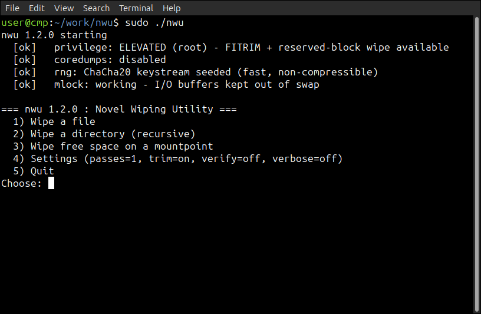

<div align="center">
   
<a href="https://github.com/effjy/nwu/"></a>


</div>

SSD-aware secure delete and free-space wipe, in C. Runs as an **interactive
menu** or from the **command line** for scripting. The novel point is that it
**combines** logical overwrite with controller-level **discard (TRIM)** in one
operation, instead of relying on either alone.

## Screenshot



## Why overwriting alone fails on SSDs

SSDs do wear leveling: a "write" lands on a fresh physical NAND page and the old
page is merely unmapped — the stale data physically survives until the
controller garbage-collects it. Over-provisioning also hides 7–28% of the chip
from the OS entirely. So `shred`-style overwrites mostly poison the *currently
mapped* copy and leave older physical copies recoverable with controller-level
tools.

The only command that authorizes the controller to physically reclaim/erase a
block is **TRIM/discard**.

## What nwu does

**File / directory wipe** (`wipe`)
1. Overwrite the bytes with a fast, non-compressible random stream + `fdatasync`
   — poisons the mapped copy and covers drives that ignore/lack TRIM. The
   overwrite is **rounded up to the filesystem block size**, so the slack at the
   tail of the final block is erased too, not just the `st_size` bytes.
2. `fallocate(PUNCH_HOLE)` the file's own extents — per-file discard while the
   fd is still open.
3. Destroy the name: several **random renames**, each followed by an `fsync` of
   the containing directory so the metadata change actually reaches disk, then
   truncate and unlink. Directories are walked depth-first (`nftw`): every file
   is wiped, symlinks/special files are dropped, then the empty dirs removed.
4. `FITRIM` the containing filesystem — tells the controller every free block
   may be erased.

**Free-space wipe** (`free`)
Fill all free space with the random stream → `fdatasync` → release → `FITRIM`
the whole filesystem. The overwrite catches slack space and non-TRIM drives; the
TRIM maximizes how much the controller is told it can physically erase. To wipe
*as much as possible*:
- as **root** it fills `f_bfree` (including the root-reserved blocks, ~5% on
  ext4), not just the unprivileged `f_bavail`;
- it **rolls onto additional fill files** when one hits the filesystem's maximum
  file size (`EFBIG` — e.g. 4 GiB on FAT32/exFAT), so the *entire* free area is
  covered rather than only the first file's worth.

The fill files are anonymous (unlinked immediately), so a crash or power loss
auto-reclaims them instead of leaving a giant file behind. A live **progress
bar** shows percentage, bytes written, throughput, and ETA. When run
interactively (a TTY), press **`s`** to stop early — nwu still syncs, releases,
and TRIMs whatever was already written.

**The random stream.** Bulk overwrite uses a userspace **ChaCha20** keystream
seeded once from `getrandom()` (verified against the RFC 8439 test vector). This
is both fast (GB/s, so large free-space wipes actually finish) and genuinely
high-entropy — SandForce-class SSD controllers transparently compress/dedupe
low-entropy patterns, which would make a naive zero/repeating fill never
physically overwrite anything. Small security-sensitive values (the seed, the
random rename names) come straight from the kernel CSPRNG.

## Prerequisites

Linux only. You just need a C compiler, `make`, and the standard libc headers —
nwu has **no third-party dependencies** (it uses only the Linux/glibc APIs:
`getrandom`, `fallocate`, `FITRIM`, `nftw`, …).

Debian / Ubuntu:
```sh
sudo apt update
sudo apt install build-essential
```

Fedora / RHEL:
```sh
sudo dnf install gcc make glibc-devel
```

Arch:
```sh
sudo pacman -S base-devel
```

## Build & install globally

```sh
git clone https://github.com/effjy/nwu.git
cd nwu
make                       # builds ./nwu
sudo make install          # installs to /usr/local/bin/nwu (on $PATH)
```

Verify:
```sh
nwu -V                     # -> nwu 1.2.0
```

Uninstall / clean:
```sh
sudo make uninstall        # removes /usr/local/bin/nwu
make clean                 # removes the local build
```

Install somewhere else with `PREFIX`:
```sh
make install PREFIX=$HOME/.local      # -> ~/.local/bin/nwu
```

## Usage

Launch the interactive menu (no arguments) — guides you through wiping a file, a
directory, or free space, with confirmation prompts:

```sh
nwu
```

Command line (for scripts):

```sh
nwu [-p N] [-T] [-c] [-v] wipe <path>...   # secure-delete file(s) and/or dir tree(s)
nwu [-p N] [-T] [-v] free <mountpoint>     # fill & wipe free space, then TRIM
```

**Options**

| Option | Meaning |
| ------ | ------- |
| `-p N` | Overwrite passes (default `1`; more passes only help on HDDs, not SSDs). |
| `-T`   | Skip the filesystem TRIM (`FITRIM`) step. |
| `-c`   | Verify the overwrite by reading it back (per-file; slower). |
| `-v`   | Verbose output. |
| `-V`   | Print version and exit. |
| `-h`   | Show help. |

**Examples**

```sh
# Securely delete a single file
sudo nwu wipe ~/secret.key

# Wipe several files and a whole directory tree at once
sudo nwu wipe ./old-keys/ report.pdf backup.tar

# Wipe the free space on a mounted drive (e.g. a USB stick), then TRIM it
sudo nwu free /media/usb

# Overwrite 3 times, verbose, no TRIM
sudo nwu -p 3 -v -T wipe ./sensitive.db

# Overwrite, then read it back to confirm the data actually landed
sudo nwu -c wipe ~/secret.key
```

`FITRIM` needs **root** and a discard-capable filesystem/stack. If discard is
unavailable (an HDD, a VM disk, or an encrypted volume like LUKS mounted without
`discard`), nwu still performs the full random overwrite — only the optional
TRIM step is skipped, which it reports in verbose mode.

> **On a fully encrypted disk** (LUKS / LVM-on-LUKS), free-space wiping is mostly
> redundant: the stale blocks are already ciphertext. There, the strongest erase
> is destroying the key — `sudo cryptsetup erase /dev/<luks-partition>` — which
> instantly renders the *whole* device unrecoverable.

## Changelog

**1.2.0**
- Add opt-in **read-back verification** (`-c`): after overwriting a file, write a
  known pattern, flush it, drop the page cache (`POSIX_FADV_DONTNEED`) and read
  it back to confirm every byte actually landed on the device (DoD 5200.28-style
  last-pass verify). Off by default; reports `VERIFY FAILED` if a write was
  silently dropped.

**1.1.0**
- Overwrite is now rounded up to the filesystem block size, erasing the slack at
  the tail of the final block (matches `shred` behavior) instead of leaving the
  old data beyond `st_size`.
- The filename is destroyed by several random renames, each followed by an
  `fsync` of the containing directory so the directory-entry rewrite reaches the
  device (previously a single rename with no directory sync).
- Free-space wipe uses `f_bfree` when root, also reclaiming the root-reserved
  blocks; and rolls onto additional fill files on `EFBIG` so FAT32/exFAT volumes
  (4 GiB max file size) get their whole free area wiped, not just 4 GiB.
- Bulk overwrite/fill now uses a fast userspace ChaCha20 keystream (seeded from
  `getrandom`, verified against RFC 8439). It runs at GB/s — so big wipes finish
  — and is non-compressible, defeating SSD controllers that transparently
  compress/dedupe low-entropy data.
- Startup banner reports the live RNG source alongside privilege/coredump/mlock.

**1.0.1**
- Startup status banner reports the run's security posture: privilege level
  (elevated/root vs unprivileged), whether coredumps were disabled, and a live
  `mlock` probe (working vs unavailable). Suppressed for `-h`/`-V`.
- Free-space wipe can be stopped early by pressing `s` (interactive/TTY runs);
  it still syncs and TRIMs what was already written.
- Warn when a file has multiple hard links (overwriting destroys the shared
  data for every link).
- Best-effort process hardening: disable coredumps (`RLIMIT_CORE` 0 +
  `PR_SET_DUMPABLE` 0) so a crash can't drop a core file onto the disk being
  wiped, and `mlock` the random I/O buffer so its contents never reach swap.
  Both are non-fatal if unprivileged. (nwu never reads target data into memory,
  so this is hardening hygiene rather than secret protection.)
- Fix: directories containing special files (FIFOs, sockets, device nodes) are
  now fully removed — such entries are unlinked during the tree walk instead of
  being skipped (which previously left the directory non-empty and `rmdir`
  failing). Explicitly naming a special file/device still refuses to overwrite.
- Add `-V` / version reporting; menu and usage now show the version.

**1.0.0**
- Initial release: SSD-aware secure file/directory delete and free-space wipe,
  interactive menu + CLI, free-space progress bar.

## Honest limitation

No userspace tool can *guarantee* erasure on an SSD — over-provisioned and
not-yet-GC'd pages are outside OS reach. For a hard guarantee use the drive's
own `ATA Secure Erase` / NVMe Format (`hdparm --security-erase`, `nvme format
--ses=1`) on the whole device. `nwu` is the best-effort, per-file / free-space
approach for a mounted, in-use system.

